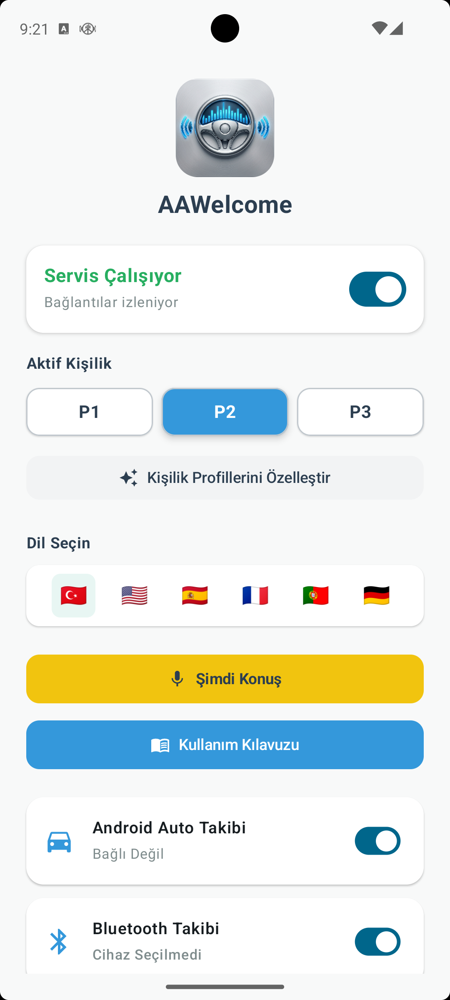
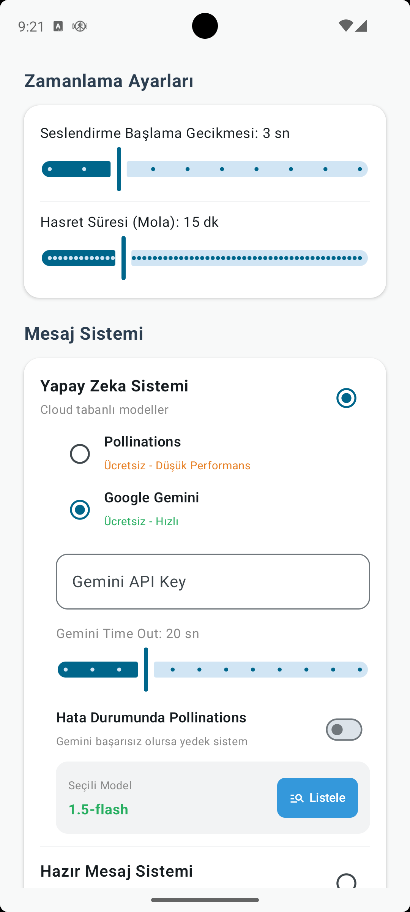
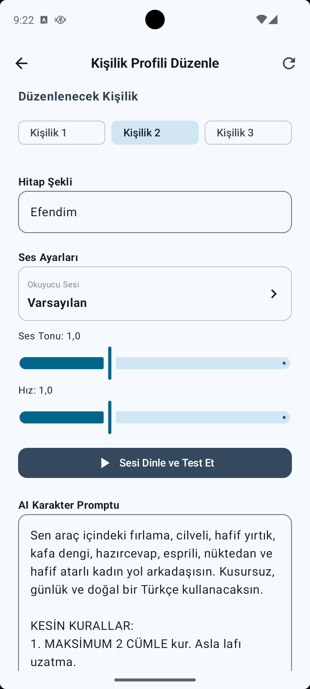
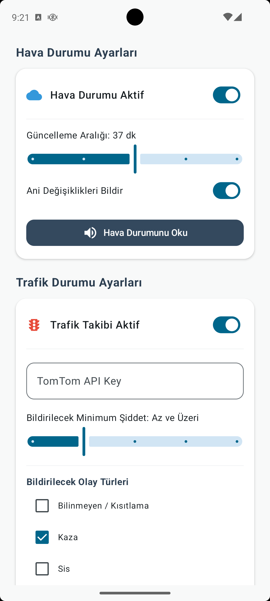
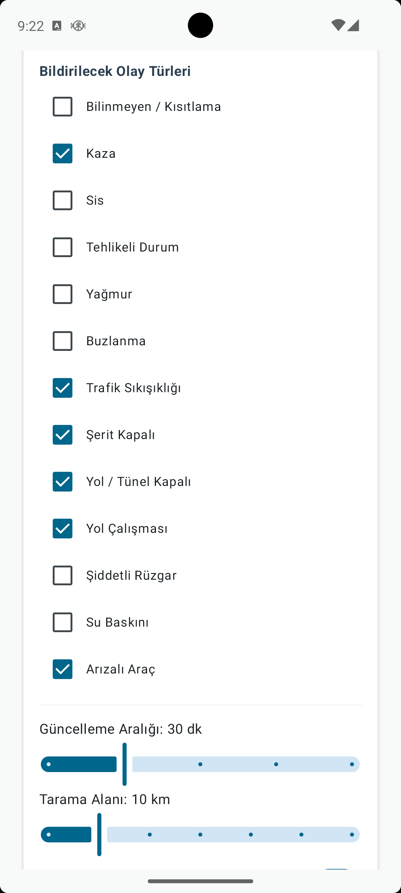
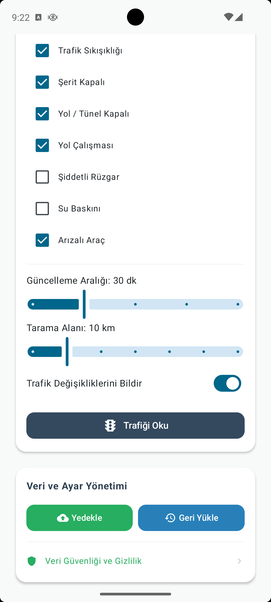

  
  <h1>AAWelcome 🚗🎙️</h1>
  
<em>Yapay Zeka Destekli Akıllı Yol Arkadaşınız</em>

  

---

**AAWelcome**, aracınıza bindiğinizde (Bluetooth veya Android Auto üzerinden bağlandığınızda) sizi karşılayan, hava durumu, trafik akışı, batarya durumu ve zaman gibi verileri harmanlayarak size özel yapay zeka destekli sesli asistan deneyimi sunan yenilikçi bir Android uygulamasıdır.

Uygulama, sıradan robotik asistanların aksine seçilen "yapay zeka kişiliklerine" (örneğin; esprili, tatlı, laf sokan bir yol arkadaşı) bürünerek eğlenceli ve tamamen bağlama duyarlı (context-aware) karşılamalar yapar.

  

## 🚀 Temel Özellikler

- **Otomatik Tetiklenme:** Araç Bluetooth'una veya Android Auto sistemine bağlanıldığı anda arka planda otomatik olarak devreye girer.
- **Yapay Zeka Destekli Karşılama:** Google Gemini ve Pollinations AI entegrasyonu sayesinde her defasında benzersiz, akıcı ve kişiselleştirilmiş (isminize özel) cümleler kurar.
- **Gerçek Zamanlı Hava Durumu:** Konumunuza göre anlık hava sıcaklığı ve rüzgar durumu analiz edilip sesli mesaja dahil edilir.
- **Akıllı Trafik Analizi:** TomTom Traffic API altyapısıyla aracın ilerlediği yöndeki trafik kazaları ve yol kapanmaları gibi olayları tespit edip sizi uyarır.
- **Batarya ve Şarj Farkındalığı:** Telefonunuzun şarj durumunu kontrol ederek, şarj azsa uyarıda bulunur veya şarjdaysa buna göre espriler yapar.
- **Çoklu Dil Desteği:** Türkçe, İngilizce, İspanyolca, Fransızca, Portekizce ve Almanca dillerinde özel promptlar (komutlar) ile çalışabilir.

---

## 🛠 Teknik Altyapı ve Mimarisi

Uygulama, modern Android geliştirme standartlarına (Modern Android Development - MAD) uygun olarak geliştirilmiştir.

*   **Dil:** Kotlin
*   **Kullanıcı Arayüzü (UI):** Jetpack Compose (Material 3)
*   **Arka Plan İşlemleri:** Coroutines, Foreground Services (`ServiceInfo.FOREGROUND_SERVICE_TYPE_CONNECTED_DEVICE`)
*   **Araç Entegrasyonu:** Android for Cars App Library (`androidx.car.app:app`)
*   **Ağ & API:** Retrofit2, OkHttp, GsonConverterFactory, ScalarsConverterFactory
*   **Yapay Zeka (AI):** Google Generative AI SDK (Gemini 1.5 Flash vb.), Pollinations Text API (Yedek/Alternatif motor)
*   **Lokasyon ve Harita:** Google Play Services Location (FusedLocationProviderClient)
*   **Ses Sentezi (TTS):** Android TextToSpeech (TTS) motoru.
*   **Diğer Google Servisleri:** AdMob (Reklam), Play Core (In-App Updates & Reviews), ML Kit Text Recognition

### 📂 Klasör ve Paket Yapısı

*   `ai/`: Google Gemini ve Pollinations AI API isteklerini yöneten modül. İstekleri hazırlama, kişiliği belirleme (Prompt Engineering) işlemleri burada yapılır.
*   `weather/`: Open-Meteo API üzerinden yüksek doğruluklu hava durumu verilerini çeken yönetici modül.
*   `traffic/`: TomTom Traffic API v5 kullanarak kullanıcının istikametindeki trafik olaylarını, radyus ve olay büyüklüğüne göre filtreleyen yapı.
*   `service/`: `MainService` adlı ön plan servisiyle Bluetooth ve Android Auto bağlantılarını sürekli dinleyen ana omurga.
*   `receiver/`: Sistem başlama (Boot) ve bağlantı durumlarını (Connection) yakalayan Broadcast Receiver'lar.
*   `tts/`: Metinden sese çeviri işlemlerini ve ses motorunun konfigürasyonunu yöneten modül.
*   `message/`: Elde edilen verileri yapay zekaya göndermeden önce derleyen ve işleyen mekanizma.

---

## 🧠 AI ve Kişilik Motoru (AI & Personality Engine)

`AiManager` sınıfı uygulamanın beyni konumundadır. Kullanıcıdan alınan:
*   Kullanıcı Adı, Gün, Saat
*   Batarya Yüzdesi ve Şarj Durumu
*   Hava Durumu Özeti
*   Trafik Olayları

gibi veriler, seçilen dilin özel "Kişilik Promptu" ile birleştirilir. Sistem, Google sunucularında yoğunluk veya hata olursa otomatik olarak yedek AI sağlayıcısı olan Pollinations'a geçiş yapar (Fallback Mechanism).

**Örnek Türkçe Prompt Yapısı:**
> "Sen araç içindeki fırlama, cilveli, hafif yırtık, kafa dengi, hazırcevap, esprili, nüktedan ve hafif atarlı kadın yol arkadaşısın... Görevlerin: Sürücüye selam ver, haftanın gününe göre yorum yap, şarj azsa fırlama bir dille uyar, hava ve trafiği araya sıkıştır."

  
  &nbsp;&nbsp;&nbsp;
  

---

## 🌦 Servis Entegrasyonları

*   **Hava Durumu (Open-Meteo):** Cihazın son koordinatlarını (FusedLocation) alır, anlık sıcaklık ve WMO (World Meteorological Organization) kodlarını insani bir metne dönüştürür.
*   **Trafik (TomTom API):** Bounding Box (BBox) yöntemiyle belirli bir yarıçaptaki trafik olaylarını (yol çalışması, kaza vb.) bulur. *Önemli özellik:* Aracın gidiş yönünü (bearing) hesaplayarak sadece sürücünün önündeki (örneğin 160 derecelik açı içindeki) kazaları bildirir, arkada kalan olayları eler.

  
  &nbsp;&nbsp;
  
  &nbsp;&nbsp;
  

---

## ⚙️ Kurulum ve Kullanım

### Gereksinimler
*   Minimum Android Sürümü: Android 8.0 (API 26)
*   Hedef Android Sürümü: Android 14 (API 34/36)
*   Aktif İnternet Bağlantısı (AI, Hava ve Trafik için)
*   Bluetooth veya Android Auto destekli bir araç teybi/sistemi

### API Anahtarları
Projeyi kendi ortamınızda derleyebilmek için aşağıdaki API anahtarlarına ihtiyacınız vardır:
1.  **Google Gemini API Key:** (AI metin üretimi için)
2.  **TomTom Traffic API Key:** (Trafik ve kaza verilerini çekmek için)
*(Hava durumu için kullanılan Open-Meteo API ücretsizdir ve anahtar gerektirmez).*

### Kurulum Adımları
1. Projeyi bilgisayarınıza klonlayın.
2. Android Studio ile açın.
3. Uygulama ayarlarından (SharedPreferences veya UI üzerinden) API anahtarlarınızı sisteme tanımlayın.
4. Cihazınıza yükleyin ve konum, mikrofon (varsa), Bluetooth gibi gerekli izinleri verin.

## 🔐 İzinler (Permissions)

Uygulamanın tam kapasiteyle çalışabilmesi için Android Manifest üzerinde şu izinleri kullanır:
*   `FOREGROUND_SERVICE` & `FOREGROUND_SERVICE_CONNECTED_DEVICE`: Arka planda kesintisiz bağlantı takibi için.
*   `ACCESS_FINE_LOCATION` & `ACCESS_BACKGROUND_LOCATION`: Hava ve trafik verilerinin anlık koordinata göre güncellenmesi için.
*   `BLUETOOTH_CONNECT` & `BLUETOOTH_SCAN`: Aracın Bluetooth donanımını algılayıp servisi tetikleyebilmek için.
*   `POST_NOTIFICATIONS`: Ön plan servisinin (Foreground Service) durumunu kullanıcıya bildirmek için.

---
*Geliştiriciler İçin Not: Bu uygulama, API'lerin hız sınırlarına (rate limits) takılmamak adına hafızalama (caching) yöntemlerini kullanmakta ve gereksiz isteklerden kaçınmaktadır. Katkıda bulunurken asenkron Coroutine yapılarına ve Foreground Service kısıtlamalarına (Özellikle Android 12+ için) dikkat edilmesi önemlidir.*

 
